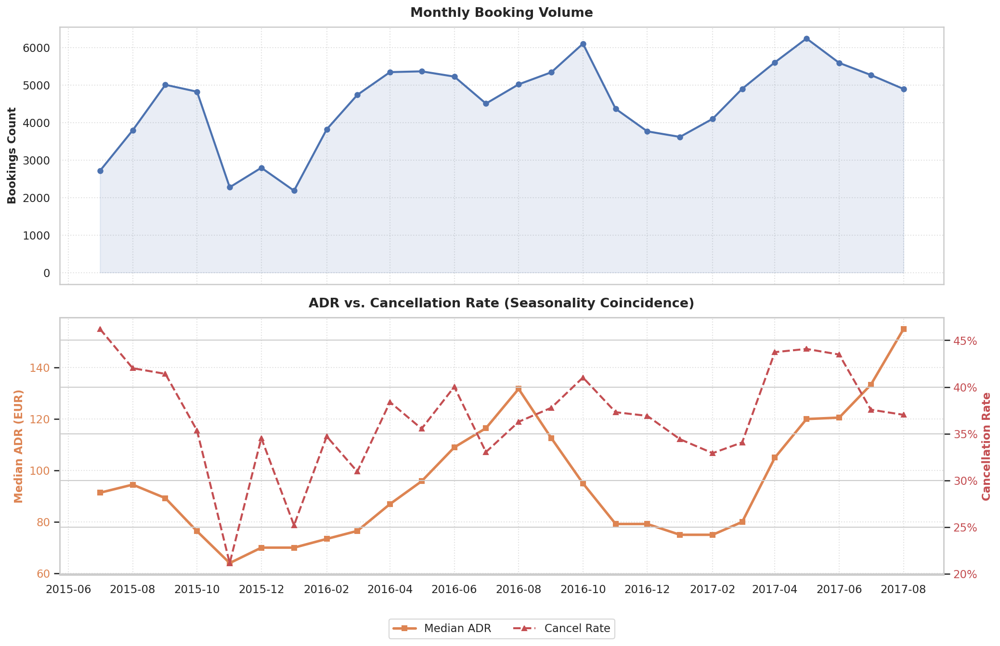
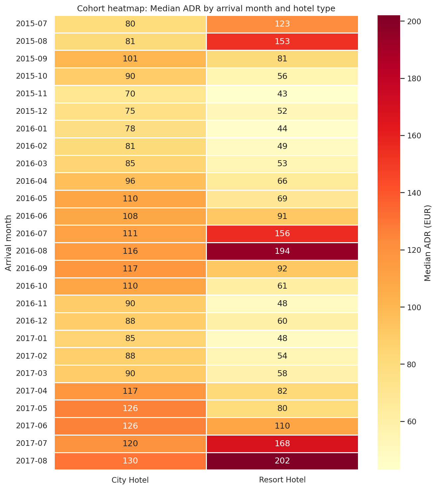
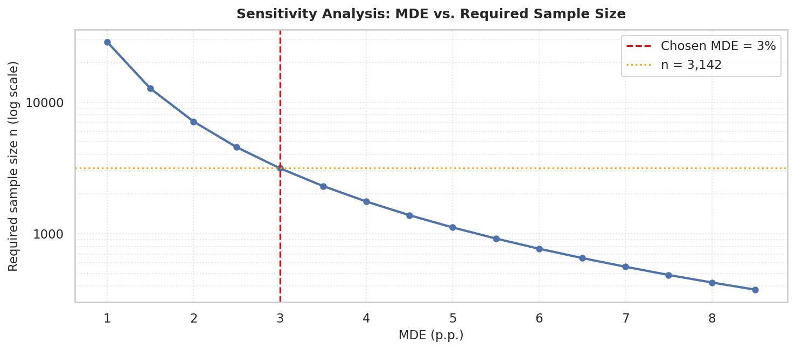
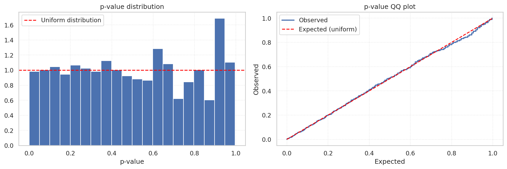
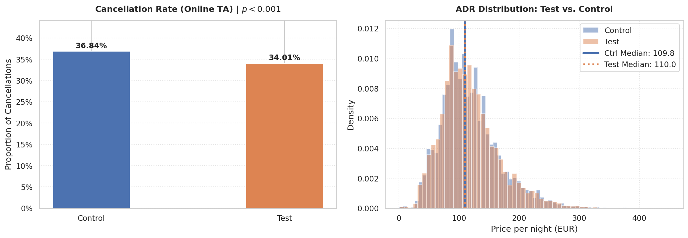
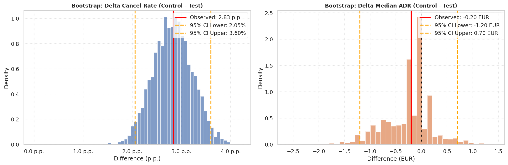
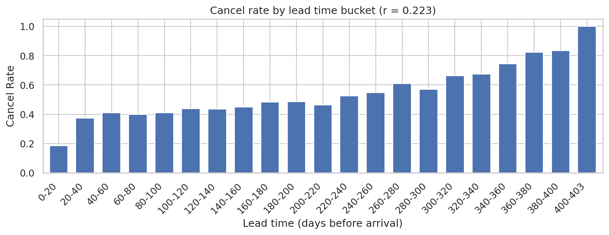
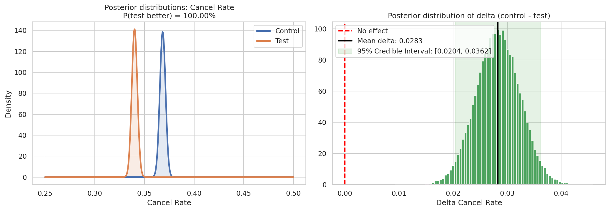
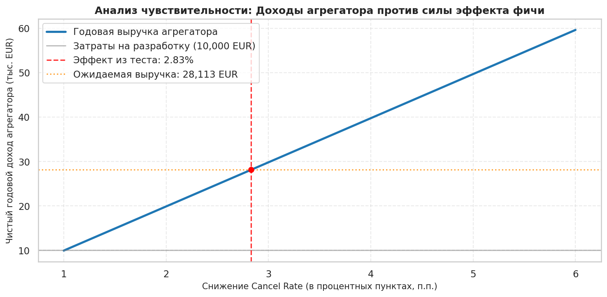

# Hotel Booking Demand: A/B Testing & Analytics

Пет-проект на датасете [Hotel Booking Demand](https://www.kaggle.com/datasets/jessemostipak/hotel-booking-demand) (Kaggle). Сымитировала полный цикл A/B-эксперимента в travel tech: гипотеза, расчёт выборки, статистическая проверка, guardrail-метрики, оценка бизнес-эффекта в деньгах.

Датасет содержит 119 390 бронирований двух отелей (City Hotel и Resort Hotel) за июль 2015 — август 2017. После очистки осталось 117 429 записей. В данных нет user ID — каждая строка это бронирование, поэтому в качестве суррогатного ID используется индекс строки, а сплит проводится на уровне бронирований, а не пользователей. Эксперимент ретроспективный: данные исторические, эффект фичи добавлен в тестовую группу вручную.

## Бизнес-кейс

Online TA — крупнейший сегмент по объёму (56 110 бронирований), cancel rate в нём 37%. Гипотеза: новая функция «Гибкие даты» (предложение альтернативных дат заезда вместо отмены) снижает Cancellation Rate в этом сегменте без потери выручки с одного бронирования.

## Что сделано

**EDA и метрики.** Распределения ADR, длины пребывания, lead time. Сезонность: ADR в Resort Hotel летом примерно вдвое выше зимнего, отмены растут синхронно с ценой. Сегментный анализ: Online TA — основной объём трафика, Groups — самый высокий cancel rate (62%), Direct — самый низкий (15%).



**Когортный анализ.** Heatmap медианного ADR по месяцу заезда и типу отеля, retention по каналам дистрибуции.



**Планирование эксперимента.** Расчёт объёма выборки через Z-критерий для пропорций (statsmodels): при MDE = 3 п.п., α = 0.05, мощность 80% нужно 3 142 бронирования на группу. При среднем потоке 70.8 заказов/день в Online TA — это 89 дней теста.



**Сплит.** Детерминированное хэширование MD5(salt + user_id) с разбиением на 100 бакетов. Проверка на Sample Ratio Mismatch (chi-squared) и баланс ковариат (lead_time, ADR, total_nights) между группами.

**A/A-тест.** 1000 симуляций случайного разбиения контрольной группы пополам без возвращения. False Positive Rate = 4.9% при ожидаемых 5% — сплит и тест работают корректно.



**A/B-тест.** Симуляция эффекта (перевод части отмен в выполненные бронирования). Z-тест для пропорций и t-тест Уэлча на Cancellation Rate, Mann-Whitney на ADR как guardrail-проверку.



**Bootstrap.** 5000 пересэмплирований, доверительный интервал для разности Cancel Rate и для разности медианы ADR — без предположений о форме распределения.



**CUPED.** Снижение дисперсии метрики через ковариату lead_time (корреляция с cancel rate 0.22). Фактическое снижение дисперсии 4.69%, экономия выборки — 156 бронирований на группу.



**Байесовский A/B-тест.** Beta-Binomial модель с неинформативным приором. P(тест лучше контроля) = 100%. Также построен график вероятности по ходу накопления данных — видно, когда тест можно было бы остановить раньше. На практике эксперимент стоит держать открытым хотя бы один полный бизнес-цикл, даже если порог уверенности достигнут раньше.



**Guardrail-метрики.** ADR и Total Nights проверены отдельно по успешным (не отменённым) бронированиям, чтобы метрики не зависели от самого эффекта снижения отмен. ADR не изменился (p = 0.96), длина пребывания немного выросла (p = 0.035) — оговорка есть в ноутбуке: это может быть артефактом симуляции на синтетических данных, а не реальным поведенческим эффектом.

**ROI.** Перевод эффекта в деньги с разделением на GMV отелей-партнёров и комиссию агрегатора (take rate 10%). Срок окупаемости фичи — 4.3 месяца, годовой ROI — 181% при затратах на разработку €10 000.



## Итоговые цифры

| Метрика | Контроль | Тест | p-value |
|---|---|---|---|
| Cancel Rate | 36.84% | 34.01% | < 0.0001 |
| ADR (успешные брони) | 115.17 EUR | 115.15 EUR | 0.96 |
| Total Nights (успешные брони) | 3.34 | 3.39 | 0.035 |

Снижение Cancel Rate подтверждено пятью независимыми методами: z-тест, t-тест Уэлча, bootstrap, CUPED, байесовский подход.

## Используемые методы

Z-тест для пропорций, t-тест Уэлча, критерий Манна-Уитни, bootstrap (percentile CI), CUPED, байесовский A/B-тест (Beta-Binomial), расчёт объёма выборки и MDE, проверка SRM, A/A-тестирование, guardrail-метрики, расчёт ROI.

## Структура репозитория

```
.
├── AB_test_hotel_pet_project.ipynb   — основной ноутбук
├── img/                              — графики
└── README.md
```

## Стек

Python, pandas, numpy, scipy, statsmodels, matplotlib, seaborn.

## Ограничения

Эксперимент проведён на исторических данных, а не на живом трафике. Эффект фичи смоделирован искусственно, а не измерен напрямую. User ID — суррогатный (индекс строки), сплит фактически на уровне бронирований. Рост Total Nights в тестовой группе может быть артефактом способа симуляции эффекта, а не реальным поведенческим сдвигом — в выводах ноутбука это явно оговорено.
